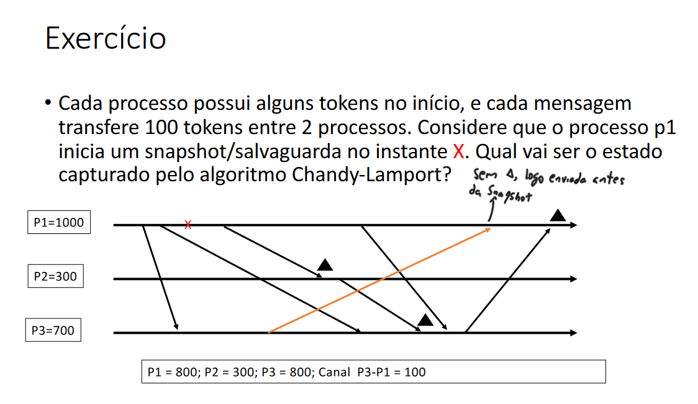
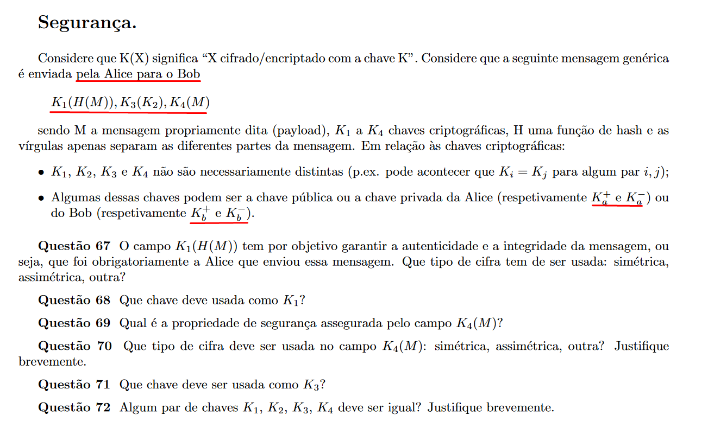
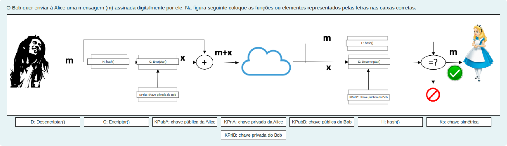

# Table of Contents

- [Table of Contents](#table-of-contents)
- [Idempotência](#idempotência)
- [Sincronização de Relógios Físicos](#sincronização-de-relógios-físicos)
    - [Sincronização Externa](#sincronização-externa)
    - [Sincronização Interna](#sincronização-interna)
  - [Algoritmo de Cristian](#algoritmo-de-cristian)
  - [Algoritmo de Berkeley](#algoritmo-de-berkeley)
- [Relógios Lógicos](#relógios-lógicos)
  - [Relógios de Lamport](#relógios-de-lamport)
    - [Limitações](#limitações)
  - [Relógios vetoriais](#relógios-vetoriais)
- [Exclusão Mútua Distribuída](#exclusão-mútua-distribuída)
  - [Ricard-Agrawala](#ricard-agrawala)
  - [Algoritmo de Maekawa](#algoritmo-de-maekawa)
- [Estados Globais](#estados-globais)
  - [Corte Coerente](#corte-coerente)
  - [Algoritmo de Chandy-Lamport](#algoritmo-de-chandy-lamport)
- [Eleição de Líder](#eleição-de-líder)
  - [Eleição em Anel](#eleição-em-anel)
  - [Bully Algorithm](#bully-algorithm)
- [Registos](#registos)
    - ["Atomic"](#atomic)
    - ["Regular"](#regular)
    - ["Safe"](#safe)
    - ["Unsafe"](#unsafe)
  - [ABD Algorithm](#abd-algorithm)
- [Espaços de Tuplos](#espaços-de-tuplos)
    - [Xu-Liskov](#xu-liskov)
- [Teorema CAP](#teorema-cap)
- [Replicação Fracamente Coerente](#replicação-fracamente-coerente)
  - [Gossip Architecture](#gossip-architecture)
    - [Dentro de cada réplica](#dentro-de-cada-réplica)
    - [Pedidos de leitura](#pedidos-de-leitura)
    - [Pedidos de modificação](#pedidos-de-modificação)
    - [Propagação de modificações](#propagação-de-modificações)
  - [Garantias de Sessão Mais Fracas](#garantias-de-sessão-mais-fracas)
- [Replicação](#replicação)
    - [Primário-secundário (replicação passiva)](#primário-secundário-replicação-passiva)
    - [Replicação de Máquina de Estados (replicação ativa)](#replicação-de-máquina-de-estados-replicação-ativa)
    - [Diferenças](#diferenças)
- [Difusão em Ordem Total](#difusão-em-ordem-total)
    - [Há dois algorimos para o caso sem falhas](#há-dois-algorimos-para-o-caso-sem-falhas)
  - [Acordo Coletivo](#acordo-coletivo)
- [Sincronia na Vista](#sincronia-na-vista)
    - [Difusão fiável síncrona na vista](#difusão-fiável-síncrona-na-vista)
      - [Violar sincronia na vista: mensagem enviada em uma vista é recebida em outra](#violar-sincronia-na-vista-mensagem-enviada-em-uma-vista-é-recebida-em-outra)
      - [Violar difusão fiável regular/atómica](#violar-difusão-fiável-regularatómica)
- [Consenso](#consenso)
  - [FloodSet Consensus](#floodset-consensus)
- [Trasações Distribuídas](#trasações-distribuídas)
  - [Strict 2-Phase Locking](#strict-2-phase-locking)
  - [2-Phase Commit](#2-phase-commit)
- [Segurança](#segurança)
  - [Chave Simétrica](#chave-simétrica)
  - [Chave Assimétrica](#chave-assimétrica)
  - [Cifra Mista](#cifra-mista)
  - [Funções de Hash Criptográficas](#funções-de-hash-criptográficas)
  - [Nonce](#nonce)
  - [Assinaturas Digitais](#assinaturas-digitais)
    - [Com chaves simétricas](#com-chaves-simétricas)
    - [Com chaves assimétricas](#com-chaves-assimétricas)

# Idempotência

Uma função é idempotente se chamadas repetidas dela resultam no mesmo estado. Por exemplo:
- `set(object,value)`: atribui o valor **value** ao objeto **object**
- `update_log(string,position)`: atualiza um log (uma lista) com uma string na sua posição **position**
- `reset(var)`: limpa a variável var indicada
- `abs(value)`: retorna o valor absoluto de **value**

Exemplos de funções **não** idempotentes:
- `increment(var)`: incrementa o valor da variável **var**
- `transfer(acc1,acc2,val)`: transfers amount **val** from **acc1** to **acc2**

# Sincronização de Relógios Físicos

### Sincronização Externa:

- Quando um ou mais nós tem acesso a uma **fonte de tempo "real"**

### Sincronização Interna:

- Os nós tentam reduzir a disparidade dos valores que os seus relógios apresentam **sem acesso a nenhuma fonte externa**
- Podem estar sincronizados entre si mas desfasados do tempo universal

## Algoritmo de Cristian

- Há um **servidor de tempo** centralizado (**sincronização externa**).
- Considera-se o tempo de envio da mensagem como "**min**".

Como funciona:

- Um cliente, para atualizar seu relógio, manda um pedido ao servidor central, que retorna um valor de tempo **x**.
- O cliente, então, atualiza o seu relógio local para $x + \frac{RTT}{2}$.
- Tem uma precisão de $\frac{RTT}{2} - min$

Se o valor de **min** for desconhecido ou muito pequeno, assume-se que é 0 para obter uma estimativa (pessimista) do erro.

---

**Exemplo**:

Um cliente tenta sincronizar com o servidor e recebe 3 respostas:

| $RTT (ms)$ | $Time(hr{:}min{:}sec)$ |
| -------- | ----------------- |
| 40       | 10:54:23.674      |
| 25       | 10:54:25.450
| 20       | 10:54:28.342

Considerando que o tempo de envio de uma mensagem é **2ms**, então o cliente atualiza o seu relógio para:

$x + \frac{RTT}{2} = 10{:}54{:}28.342 + 10ms = 10{:}54{:}28.352$

Tendo uma precisão de $\frac{RTT}{2} - min = 10ms - 2ms = 8ms$

## Algoritmo de Berkeley

Permite fazer a **sincronização interna** de um grupo de computadores:
- Periodicamente, o *master* pergunta aos outros processos qual o valor dos seus relógios
- Para cada resposta, o *master* estima a hora do emissor usando a abordagem do Cristian
    - **Nota:** para muitos exercícios é assumido que $RTT = 0$ para facilitar os cálculos
- O *master* calcula a nova hora do sistema por uma média dos valores (incluindo o seu), e envia o acerto correspondente a cada computador
- Para tolerar falhas, não considera aqueles que têm desvios exagerados ou cuja resposta não chegou num tempo razoável

Se o mestre falha é preciso eleger um novo.

---

**Exemplo:**

O computador **A** (*master*) pergunta aos restantes qual o valor do seu relógio e recebe respostas de **B** e **C** com os seguintes valores (no formato $hr{:}min{:}sec$):
- **B**: $13{:}00{:}15$
- **C**: $12{:}59{:}55$

O relógio de **A** marca $12{:}59{:}35$. Qual o valor com que cada um dos relógios deve ser ajustado? (Para simplificar, considere que o $RTT$ das mensagens trocadas é igual a zero)

A média dos 3 valores será:

$\dfrac{12{:}59{:}35 + 13{:}00{:}15 + 12{:}59{:}55}{3}$ $=12{:}59{:}55$

**Nota:** \
Uma forma alternativa de pensar neste cálculo é pegar no valor do *mestre* e ver quanto que cada um dos outros varia em relação a este: pensando em $12{:}59{:}35$ como a base, temos dos outros servidores a variação de $+40$ e $+20$, logo a média a variar é $\dfrac{0+40+20}{3}=+20$, o que quer dizer que o valor que queremos sincronizar é  $12{:}59{:}35+20=12{:}59{:}55$

Concluindo, pelo **algoritmo de Berkeley**, é feito um acrescento de $+20$ para A, $-20$ para B e $+0$ para C.

---

**Observação**: no pior caso, a diferença entre os valores dos relógios de dois processos *p1* e *p2* é a soma dos erros dos dois.

# Relógios Lógicos

## Relógios de Lamport:

### Limitações:
- $T(e)<T(e')$ não implica que $e$ aconteceu-antes de $e’$
- $T(e)=T(e´)$ não implica $e = e’$

## Relógios vetoriais:

- $V<=V’$ sse $V[j] <= V’[j]$ para $j=1,2,...N$
- $V<V’$ sse $V<= V’ e V !=V’$
- $e$ **aconteceu-antes** $e’$ sse $V(e)<V(e’)$
- $e$ **é concorrente com** $e’$ sse não se verificar nenhuma destas condições:
    - $V(e)=V(e’)$ e $V(e)<V(e’)$ ou $V(e’)<V(e)$

### Exemplo mais complexo:

# Exclusão Mútua Distribuída

## Ricard-Agrawala

Fucking sucks, lmaoo

Solução descentralizada (sem servidor central)

- Há 3 estados: **RELEASED**, **HELD** e **WANTED**.
- No início, estão todos em estado **RELEASED**.
---
- Para entrar em secção crítica:
    - Muda estado para **WANTED**
    - Manda *request* a todos os outros processos com uma **timestamp**
    - Espera até resposta de todos
    - Depois de receber todas as respostas, muda estado para **HELD**

- Quando $p_i$ recebe um *request* de $p_j$:
    - Se estado = **HELD** ou (estado = **WANTED** e $T(p_i)<T(p_j)$)
        - dá queue no pedido de $p_j$ sem responder ($p_i$ tem prioridade)
    - Caso contrário:
        - responde à $p_j$ imediatamente

- Para sair da secção crítica:
    - Estado = **RELEASED**
    - Responde a todos os *request* na queue

### Exemplo:

#### 23)
- $r1$: responde ao pedido OK (estado **WANTED**, mas pedido de $P1$ tinha menor timestamp)
- $r2$: dá queue ao pedido de $P3$ (estado **WANTED**, mas $P1$ tem menor timestamp)
- $r3$: responde ao pedido OK (estado **RELEASED**)
- $r4$: responde ao pedido OK (estado **RELEASED**)

#### 24)
- Se os dois pedidos tem a mesma timestamp, o desempate é feito a partir do identificador do processo

## Algoritmo de Maekawa

Processos organizados em subconjuntos processos de chamados quóruns ($V_0$, $V_1$, etc.)
- Um processo pode pertencer a mais que um quórum
- Para qualquer par de quóruns, a sua interceção não pode ser vazia ($V_i\cap V_j \neq \varnothing$)
- Cada processo pode **votar** num pedido de entrada em secção crítica, mas nunca pode votar em mais que um pedido em simultâneo
---

Três estados, **RELEASED**, **WANTED** e **HELD**, e um boolean **voted**. No início, todos os processos estão em estado **RELEASED** e $voted = FALSE$.

---

- Para $p_i$ entrar na secção crítica:
  - Muda estado para **WANTED**
  - Manda *request* a todos os processos no seu quórum $V_i$
  - Espera até receber todas as respostas
  - Muda estado para **HELD**

- Quando $p_i$ recebe um *request* de $p_j$
    - Se (estado = **HELD** ou $voted = TRUE$)
        - dá queue no pedido de $p_j$ sem responder 
    - Caso contrário:
        - responde à $p_j$
        - $voted = TRUE$

- Para $p_i$ sair da secção crítica:
    - estado = **RELEASED**
    - Manda *release* a todos os processos no seu quórum $V_i$

- Ao $p_i$ receber *release* de $p_j$:
    - Se (queue não está vazia)   
        - Remove a frente da queue, por exemplo $p_k$
        - Manda resposta à $p_k$
        - $voted = TRUE$
    - Caso contrário:
        - $voted = FALSE$ 

### Exemplo:

- $p_2$ muda seu estado para **WANTED** e envia pedido à $p_3$ (mas não $p_1$ porque está fora do seu quórum)
- $p_3$ está em estado **RELEASED** e tem $voted = FALSE$, logo responde à $p_2$ e muda para $voted = TRUE$
- $p_2$ não consegue obter a lock mesmo depois da resposta, logo se adiciona à sua própria queue

# Estados Globais

Fazer cortes coerentes para capturar o estado de um SD. Por ser útil para guardar o estado para backup, verificar propriedades do sistema ou até para fazer debug.

## Corte Coerente

Um corte é coerente se, para cada um dos seus eventos, o corte inclui todos os eventos que **acontecem-antes** desse evento.

Em outras palavras, um corte é coerente se **todas as mensagens recebidas foram também enviadas**.

### Exemplo:

## Algoritmo de Chandy-Lamport

(Retirado da wikipedia, mas explica bem)

1. The observer process (the process taking a snapshot):
    - Saves its own local state
    - Sends a snapshot request message bearing a snapshot token to all other processes (nos exercícios é normalmente a próxima mensagem enviada)
2. A process receiving the snapshot token for the first time on any message:
    - Sends the observer process its own saved state (não representado nos gráficos)
    - Attaches the snapshot token to all subsequent messages (to help propagate the snapshot token)
3. When a process that has already received the snapshot token receives a message that does not bear the snapshot token, this process will forward that message to the observer process. This message was obviously sent before the snapshot "cut off" (as it does not bear a snapshot token and thus must have come from before the snapshot token was sent out) and needs to be included in the snapshot.

### Exemplo Simples

### Exemplo Mais Complexo

# Eleição de Líder

Em ambos os algoritmos ensinados, o líder é decidido como sendo o processo com maior identificador.

## Eleição em Anel

- Quando um processo inicia uma eleição:
    - Marca-se como participante
    - Manda uma mensagem *election(ID)* com seu ID ao próximo do anel
- Quando um processo recebe uma mensagem *election(ID)*:
    - Se o ID na mensagem for maior que o seu, marca-se como participante e reencaminha ao próximo do anel
    - Se o ID na mensagem for menor que o seu e ainda não participava, marca-se como participante e manda *elected(ID)* ao próximo do anel com o seu ID
    - Se o ID na mensagem for o seu e já participou, então é eleito como líder:
        - Marca-se como não participante e manda uma mensagem *elected(ID)* com seu ID
- Quando um processo recebe uma mensagem *elected(ID)*:
    - Aprende que o novo líder é o indicado na mensagem, marca-se como não participante e reencaminha a mensagem 
    - Se o ID na mensagem for o seu, acabou o algoritmo

### Exercício:

## Bully Algorithm

Assume-se que todos os processos sabem o ID de todos os outros processos.

Há 3 tipos de mensagens:
1. **Election**: para iniciar uma eleição
2. **OK**: responde à mensagem **Election** para mostrar que está ativo
3. **Coordinator**: enviado pelo vencedor da eleição para anunciar-se como coordenador

---

Imagine um exemplo com 6 processos, $p_0$, $p_1$, $p_2$, $p_3$, $p_4$ e $p_5$. O líder é $p_5$, aquele com o maior ID.

- Imagine que o processo $p_2$ manda uma mensagem ao líder $p_5$, e este não responde após um certo tempo (o servidor pode ter falhado)
- O processo $p_2$ então manda uma mensagem **election** a todos os processos com ID maior, ou seja, $p_3$, $p_4$ e $p_5$
    - Se ninguém responde, $p_2$ ganha a eleição e vira o novo líder;
    - Se qualquer processo responde com **OK**, então este processo vai continuar o processo.
- Este processo então recomeça o processo e manda **election** a todos os processos com ID maior que o seu (i.e. $p_3$ irá enviar para $p_4$ e $p_5$, enquanto $p_4$ irá enviar só para $p_5$)
    - $p_4$ irá responder **OK** a $p_3$ e $p_4$ não irá receber resposta de nenhum, logo $p_4$ se determina como líder e manda mensagem **Coordinator** para todos os processos vivos
    - Se um processo voltar à vida (i.e. $p_5$), ele começa uma eleição automaticamente. Sendo $p_5$ aquele com o maior ID, ele mandaria imediatamente a mensagem **Coordinator** a todos os outros processos e voltará a ser o líder

### Exercício:

# Registos

Lamport definiu três modelos de coerência para registos:
- Atomic
- Regular
- Safe

Um registo "Unsafe" não segue nenhum destes três.

### "Atomic"

Equivalente à linearizabilidade: o resultado da execução é equivalente ao resultado de uma execução em que todas as escrtas e leituras ocorrem instantaneamente num ponto entre o início e o fim da operação.

### "Regular"

- Se uma leitura não for concorrente com uma escrita, lê o último valor escrito.
- Se uma leitura for conconcorrente com uma escrita ou retorna o valor anterior ou o valor que está a ser escrito.

### "Safe"

- Se uma leitura não for concorrente com uma escrita, lê o último valor escrito.
- Se uma leitura for conconcorrente com uma escrita pode retornar um valor **arbitrário**.

### "Unsafe"

### Exemplos de todos:

## ABD Algorithm

"O algoritmo da maioria"

Escrita:
- O escritor incrementa o número de versão e envia o tuplo **<valor, versão>** para todos os processos.
- Ao receber esta mensagem, os outros processos atualizam a sua cópia do registo (se a versão for superior à que possuem) e enviam uma confirmação ao escritor.
- A operação de escrita considera-se terminada quado o escritor receber resposta de uma maioria.

Leitura:
- O leitor envia uma mensagem a todos os processos solictando o tuplo mais recente
- Cada processo envia o seu tuplo **<valor, versão>**
- Após receber resposta de uma maioria, o leitor retorna o valor com a versão mais recente (e actualiza o seu próprio tuplo, caso necessário)

### Exemplo complexo do processo

### Exemplos simples

# Espaços de Tuplos

Não precisa dizer muito pois foi o foco do projeto.

### Xu-Liskov:

### Exemplo

# Teorema CAP

(Provavelmente pouco importante, mas é algo provado)

É impossível ter simultanemente:
- Coerência (consistency)
- Disponibilidade (availability)
- Tolerar particções na rede (partition-tolerance)

Só é possível ter **duas** destas coisas (à escolha)

# Replicação Fracamente Coerente

## Gossip Architecture

- Cada cliente mantém um **timestamp vetorial** chamado **prev**
    - **Vetor** de inteiros, um inteiro por cada réplica
    - Reflete a última versão acedida pelo cliente de cada réplica
- Em cada pedido a uma réplica, **cliente envia (pedido, prev)**
- Réplica responde com **(resposta, new)**
    - *new* é o timestamp vetorial que reflete o **estado da réplica** ($replicaTS$?)
    - Se réplica estiver atrasada espera até se atualizar
- Cliente **atualiza _prev_ com _new_**
    - Para cada entrada $i$, atualiza $prev[i]$ se $new[i] > prev[i]$

### Dentro de cada réplica:

- **Replica timestamp** ($replicaTS$) reflete as modificações no log
- **Value timestamp** ($valueTS$) reflete as modificações executadas localmente

### Pedidos de leitura:

Réplica verifica se $pedido.prev \le valueTS$
- Se sim, retorna o valor atual (junto com o value timestamp)
- Se não, o pedido fica pendente

### Pedidos de modificação

Quando réplica $i$ recebe o pedido vindo do cliente:
- Verifica se não o executou já. Se sim, descarta-o, caso contrário:
  - Incrementa a entrada $i$ do seu $replicaTS$ em uma unidade
  - Substitui a entrada $i$ de $pedido.prev$ pelo novo valor calculado acima (assim, este timestamp é único para este update)
  - Junta a modificação ao log e retorna o novo timestamp ao cliente
  - Espera até $pedido.prev \le valueTS$ se verificar para executar o pedido localmente
  - Quando executar o pedido, atualiza o $valueTS$
    - Para cada entrada $i$, atualiza $valueTS[i]$ se $replicaTS[i] > valueTS[i]$

### Propagação de modificações

- Periodicamente, cada gestor de réplica $i$ contacta outro gestor de réplica $j$
- $i$ envia a $j$ as modificações do log de $i$ que estima $j$ não ter, em ordem
- Para cada modificação que $j$ recebe:
    - Se não for duplicada, acrescenta-a ao seu log
    - Atualiza o seu $replicaTS$
    - Assim que $prev \le valueTS$, executa a modificação

---

---

### Exercício

#### 43)

$S1$ e $S2$ não retornam, pois $pedido.prev$ não é $\le replicaTS$.

$S3$ retorna, pois $(2,5,5) \le (2,5,8)$. O relógio vetorial retornado é (2,5,8).

#### 44)

Todos respondem:

$S1$, $S2$ e $S3$ incrementam a sua respectiva entrada do seu $replicaTS$
  - $S1 = (3,4,2)$
  - $S2 = (1,7,7)$
  - $S3 = (2,5,9)$

Como $pedido.prev_i \le replicaTS_i$ para todas as réplicas, cada uma delas retorna $pedido.prev$ com a sua entrada $i$ substituída pelo seu novo valor de $replicaTS_i$. Isto é:
- $S1$ retorna $(3,5,5)$
- $S2$ retorna $(2,7,5)$
- $S3$ retorna $(2,5,9)$

Nenhum deles executa o pedido localmente, pois em nenhuma réplica $pedido.prev \le valueTS$. Pela mesma razão, $valueTS$ não é atualizado em nenhuma réplica.

---

### Exercício 2

Só as operações A e B foram executadas localmente ($pedido.prev \le valueTS$).

## Garantias de Sessão Mais Fracas

(Não sei o quão importante é isso)

Guarantee | Session state check on | Session state updated on |
| --- | --- | --- |
| Read Your Writes | Read | Write |
| Monotonic Reads | Read | Read |
| Writes Follow Reads | Write | Read |
| Monotonic Writes | Write |Write |

# Replicação

**Dois tipos:**
- Recuperação "para trás"
  - Guardar o estado da aplicação, periodicamente ou em momentos relevantes (usando um algoritmo de corte coerente, por exemplo)
  - Quando um ou mais processos falham, estes são relançados o mais rapidamente possivela partir do último estado guardado
  - Tipicamente designado por "checkpoint-recovery" (são backups, basicamente)

- Recuperação "para frente"
  - São mantidas várias cópias (réplicas) do processo
  - Quando uma réplica é alterada as outras também devem ser atualizadas
  - Se uma réplica falha os clientes podem usar outra
  - Exemplos que usam: Algoritmo ABD para registos, Xu-Liskov para espaços de tuplos

---

Para recuperação para frente há duas variações principais:
- Primário-secundário
- Replicação de máquina de estados

### Primário-secundário (replicação passiva)

- Um processo é eleito como primário (se este falha é eleito um novo)
- Os clientes enviam pedidos ao primário
- Para cada pedido recebido, o primário:
  - Executa o pedido
  - Propaga o estado para os secundários e aguarda confirmação de todos
  - Responde ao cliente

 

### Replicação de Máquina de Estados (replicação ativa)

É a mesma lógica que o utilizado na terceira entrega do projeto.

- Os clientes enviam pedidos a todas as réplicas
- Todos os pedidos **são ordenados por ordem total**
- Todas as replicas processam os mesmos pedidos, pela mesma ordem (assume-se que operações são determinísticas)

### Diferenças

Primário-secundário:
- Suporta operações não deterministas (o líder decide o resultado)
- Porém, se o líder produzir um valor errado, este é propagado para as outras réplicas

Replicação de máquina de estados
- Se uma réplica produzir um valor errado não afecta as outras réplicas
- Porém, as operações precisam de ser deterministas

# Difusão em Ordem Total

Antes disso, alguns termos notáveis:

**Canais Perfeitos**: Garante a entrega de mensagens, ponto a ponto, de forma ordenada, no caso
em que tanto o emissor como o destinatário não falham.\
**Difusão Fiável**: Permite enviar uma mensagem em difusão com a garantia que todos os destinatários recebem a mensagem ou nenhum recebe.\
**Difusão Atómica**: Difusão fiável e com ordem total.

Algoritmos para **difusão fiável** (só saber a ideia geral é o suficiente):
- **Difusão fiável regular**:
  - Mensagem é enviada usando canal perfeito para todos os membros do grupo
  - Quando um membro recebe a mensagem, entrega-a à aplicação e à todos os membros do grupo
- **Difusão fiável uniforme**: 
  - Mensagem é enviada usando canal perfeito para todos os membros do grupo
  - Quando um membro do grupo recebe a mensagem, reenvia-a para todos os membros do grupo
  - Quando um membro receber uma mensagem _m_ de _f_ membros distintos, entrega a mensagem _m_ à aplicação (onde _f_ é o número de processos que pode falhar)

### Há dois algorimos para o caso sem falhas

- Ordem total baseada em **sequenciador**:
    - As mensagems são enviadas para todas as réplicas usando um algoritmo de difusão fiável.
    - Uma das réplica é eleita líder, decide qual a ordem pela qual as mensagens devem ser processadas, e envia esta informação para as réplicas restantes.
- Ordem total baseada em **acordo colectivo**:
    - Decide ordem da operação como o maior sequence number desta operação entre todos os processos (vejam os exercícios)

## Acordo Coletivo

Este algoritmo atribui como número de sequência final o maior número de todos os processos, contando que tenha sido proposto um valor em todos os processos.

#### 51) 4
#### 52) B, pois está marcada como "final" na posição 2 e A foi determinada como sendo 4
#### 53) 6

# Sincronia na Vista

**Vista**: conjunto de processos que pertence ao grupo. O sistema evolui através de uma sequência totalmente ordenada de vistas.

Permite mudar a filiação de um grupo de processos de uma forma que facilita a tolerância a faltas.

### Difusão fiável síncrona na vista:

- Se um processo correto $p$ na vista $V_i$ envia uma mensagem *m* na vista $V_i$, então _m_ é entregue a $p$ na vista $V_i$
- Se um processo entrega uma mensagem _m_ na vista $V_i$, todos os processos correctos da vista $V_i$ entregam _m_ na vista $V_i$

#### Violar sincronia na vista: mensagem enviada em uma vista é recebida em outra

#### Violar difusão fiável regular/atómica

# Consenso

- Num conjunto de N processos, cada um propõe um valor (input)
- Todos os processos decidem o mesmo valor (output)
- O valor decidido pode ser qualquer um dos valores propostos

## FloodSet Consensus

- Cada processo tem um vetor de valores propostos, inicialmente com só o seu valor
- Em cada round ($1 \le r \le f+1$, onde $f$ é o número de processos que pode falhar):
  - Cada processo manda para todos os processos todos os valores do seu vetor que não enviou antes

Depois de $f+1$ rounds, se decide o menor (ou maior) valor.

# Trasações Distribuídas

## Strict 2-Phase Locking

Método pessimista de controlo de concorrência baseado na obtenção automática de trincos sobre os dados à medida que a transação executa. Cada objecto tem associados trincos de leitura e trincos de escrita.

- Quando uma transação acede a um objecto para leitura pela primeira vez tenta obter um **trinco de leitura** nesse objecto.
- Quando uma transação acede a um objecto para escrita pela primeira vez tenta obter um **trinco de escrita** nesse objecto. Não é possível obter um lock de escrita se outra transação já tem um lock de leitura no mesmo objeto.

É possível atribuir **prioridades** a certas operações, criando a possibilidade de operações de maior prioridade abortar operações com menor prioridade (e estas voltam a estar à espera) 

## 2-Phase Commit

- Um dos participantes é eleito como coordenador
- O coordenador envia uma mensagem  "_prepare_" para todos os participantes.
- Para cada participante:
  - Se conseguir confirmar a Transação (executou sem abortar e o "redo log" já está guardado em memória persistente), acrescenta ao "log" um registo a indicar que vota favoravelmente e envia "_ok_" ao coordenador.
  - Se não puder confimar a Transação, acrescenta ao "log" um registo a indicar que vota desfavoravelmente e envia "_not-ok_" ao coordenador.
- Se o coordenador receber "_ok_" de todos os participantes, decide confirmar a Transação:
  - Acrescenta ao seu "log" uma entrada indicado que a Transação foi confirmada
  - Avisa os outros participantes deste facto (estes também registam o resultado no seu próprio "log").
- Se o coordenador receber "_not-ok_" de **pelo menos um** participante, decide abortar a Transação:
  - Acrescenta ao seu "log" uma entrada indicado que a Transação foi abortada
  - Avisa os outros particiopantes deste facto (estes também registam o resultado no seu próprio "log")

**Observação**:

- Se um dos participantes não responder ao coordenador, este pode tentar contacar o participante de novo ou, se suspeitar que este participante falhou, abortar a Transação
- Neste caso a falha do participante é equivalente a um "not-ok".

**Um problema**:

- Este algoritmo é bloqueante se o coordenador falha:
  - Um participante, depois de responder "_ok_" já não pode mudar de opinião e tem de esperar pela decisão do coordenador (os objectos necessitam de permancer protegidos pelos trincos até a Transação terminar)
- Se o coodenador falhar, esses objectos ficam bloqueados até o coordenador recuperar

---

Uma maneira de obter uma versão tolerante a faltas da confirmação atómica consiste em usar o **consenso** como módulo:
- Os participantes enviam "_ok_" ou "_not-ok_" para todos os outros participantes, e não apenas para o coordenador
- Todos os participates colecionam as respostas de todos os outros participantes e depois invocam o consenso:
  - Se um participante recebe "_ok_" de todos os participantes, inicia o consenso propondo "_commit_"
  - Se um participante recebe pelo menos um "_not-ok_", inicia o consenso propondo "_abort_"
  - Se um participante suspeita que outro participante falhou, inicia o consenso propondo "_abort_"
  - Todos os participantes confirmam ou abortam a Transação de acordo com o resultado do consenso

**NOTA:** Se um participante propõe "abort" para consenso e outro participante a propõe "commit", qualquer um destes resultados é um output válido do consenso

# Segurança

## Chave Simétrica

Uma chave que **cifra e decifra** um certo input, isto é, $K(m)$ retorna uma cifra de uma mensagem $m$, e $K(K(M))$ retorna a mensagem original.

Permite criar um canal seguro entre A e B desde que ambos saibam o segredo K.

## Chave Assimétrica

Cada entidade possui um par de chaves **(K+, K-)** designadas por **chave pública e chave privada**.
- A chave pública $K^+$ é revelada às restantes entidades
- A chave privada $K^-$ é mantida secreta

Não é possível obter $K^+$ a partir de $K^-$ nem $K^-$ a partir de $K^+$.

Estas chaves tem as seguintes propriedades:
- $K^+(K^-(m))=m$
- $K^-(K^+(m)=m$

Isto é, uma mensagem cifrada com a chave pública de A só pode ser decifrada com a chave privada de A, e vice-versa. Isto permite, por exemplo:

- Se a entidade A pretender enviar a B um texto _m_ ao qual apenas B pode ter acesso, cifra _m_ com a chave pública de B, $K_b^+$
  - Assim, apenas B pode decifrar esta mensagem com a sua chave privada.
- Se a entidade A pretender provar a B que o texto _m_ foi produzido por A, cifra _m_ com a sua chave privada, $K_a^-$.
  - B pode decifrar a mesagem recebida com a chave pública da A, Ka+. Se tiver
sucesso, a mensagem foi produzida por A, pois apenas A conhece $K_a^-$.

## Cifra Mista

A criptografia assimétrica é muito mais lenta que a criptografia simétrica.

Logo, muitas vezes é utilizada cifra mista:
- Cifra assimétrica é usada para negociar uma chave simétrica, durante a fase criação do canal seguro.
- A chave simétrica é posteriormente usada para cifrar a informação trocada no canal.

Por exemplo, A cria uma chave simétrica $K_s$, cifra $K_s$ com a chave
pública de B ($K_b^+$), e envia a chave cifrada ($K_b^+(K_s)$) para B. Assim, apenas B pode aceder a $K_s$ através da sua chave privada $K_b^-$.

## Funções de Hash Criptográficas

Função criptográfica que, dado um texto _m_ cria uma síntese de tamanho fixo deste texto (designado por "digest"), $H(m)$
- Uma propriedade fundamental destas funções é que é computacionalmente inviável encontrar em tempo útil outro texto _m'_ tal que $H(m') = H(m)$

## Nonce

Um **nonce** é uma palavra única que é usada para identificar uma troca de mensagens e que nunca é usada de novo em trocas posteriores.

O objectivo da utilização de nonces é evitar o que designa por um "replay attack":
- Um intruso captura todas as mensagens trocadas e, mesmo tendo apenas acesso ao conteúdo cifrado, re-executa posteriormente a mesma sequência

## Assinaturas Digitais

### Com chaves simétricas

- A cria uma versão estendida do texto, $(m|Ks)$ (i.e. concatena $K_s$ ao fim de $m$)
- A usa uma função de hash criptográfica para gerar o resumo da versão estendida $S_m = H(m|K_s)$
- A envia ambos os elementos a B, e B verifica se Sm = H(m|Ks)

### Com chaves assimétricas

- A usa uma função de hash criptográfica para gerar o digest da mensagem, $H(m)$
- A usa a sua chave privada $K_a^-$ para cifrar $H(m)$
- $K_a^-(H(m))$ serve como assinatura de m, e qualquer entidade pode usar a chave pública $K_a^+$ de A para validar a assinatura

### Um exercício para solidificar tudo

#### 67 e 68)

$K_1$ será a chave privada da Alice, isto é, $K_a^-$. $K_a^-(H(M))$ é usada como assinatura da Alice.

#### 69)

A propriedade assegurada por $K_4(M)$ é a confidencialidade da mensagem M.

#### 70)

$K_4(M)$ deve ser uma chave simétrica, por questões de desempenho.

#### 71)

$K_3$ deve ser a chave pública de Bob, isto é, $K_b^+$, para que Bob possa obter $K_2$ a partir da sua chave privada.

#### 72)

$K_2$ e $K_4$ (vamos chamar de $K_s$) devem ser a mesma chave (simétrica), porque desta forma:

- $K_a^-(H(M))$ serve como assinatura da Alice;
- $K_b^+(K_s)$ cifra a chave pública para que só Bob possa obtê-la utilizando sua chave privada
- $K_s(M)$ utiliza a chave simétrica para cifrar a mensagem 

### Resumindo:

$K_1 = K_a^-$

$K_2 = K_4$ = $K_s$

$K_3 = K_b^+$

- Alice cifra a mensagem com a chave simétrica
  - $K_s(M)$
- Alice cifra a chave simétrica utilizando a chave pública de B.
  - $K_b^+(K_s)$
- Assim, B pode obter a chave simétrica usando a sua chave privada.
  - $K_b^-(K_b^+(K_s)) = K_s$
- Para garantir que foi Alice que enviou a mensagem, Alice aplica uma Hash à mensagem
  - $H(M)$
- Depois, cifra $H(M)$ com a sua chave privada
  - $K_a^-(H(M))$
- Assim, depois de Bob obter _m_ ele pode aplicar a hash à mensagem, usar a chave pública de A em  $K_a^-(H(M))$, e ver se os resultados são os mesmos
  - $K_a^+(K_a^-(H(M))) = H(M)$
  - Isto garante que a mensagem foi enviada por A

### Exemplo de envio de mensagem assinada (sem encriptar)

